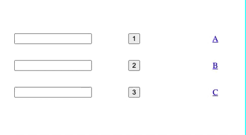

# Controles de la UI y manejo del foco

## Tus apuntes ✏️

Puedes usar este espacio para apuntar tus aprendizajes de esta lección.


## Outline

Los sitios y aplicaciones web están desarrollados, generalmente para ser usados con el mouse, sin embargo, a las personas con discapacidades visuales y/o discapacidades motoras les cuesta usar ese dispositivo. Por lo que, el teclado es una de las herramientas que les sirve de apoyo para navegar en Internet.

HTML establece un conjunto de elementos denominados `controles`, los cuales permiten ser `enfocados` a través del teclado y proporcionar mejoras de accesibilidad para el elemento en cuestión. Etiquetas como `<button />`, `<a />`, `<input />`, `<select />`, `<textarea />` pueden ser alcanzadas usando:

- `tab` para moverse entre controles hacia adelante.
- `shift + tab` para moverse entre controles hacia atrás.




Esto le permite al usuario asistido navegar a través de las acciones del sitio mucho más fácilmente. Adicionalmente, le agrega un indicador al control que se encuentre enfocado (`focus`) indicandole en donde se encuentra el foco en ese momento.

Tener elementos que faciliten a los usuarios asistidos la navegación de nuestro sitio, sin necesidad agregar código adicional de CSS y Javascript supone razones importantes para que sean utilizados. La creación de estos `controles` de manera artificial representa un antipatrón que repercute en problemas de accesibilidad, performance e inviabilidad tecnica en los proyectos, estos son algunos de los antipatrones comunes:

- Botones hechos con divs. 🚫
- Enlaces (ligas) hechas con etiquetas de texto. 🚫
- Selects hechos con Javascript. 🚫


### El indice del tab

El movimiento del foco se desplaza de manera natural y en el orden en que los controles están establecidos a lo largo del documento HTML de esta manera:

```html
  <button>Yo me enfoco de primero</button>
  <section>
    <label>
      Yo me enfoco de segundo
      <input type="text" />
    </label>
  </section>
  <a>Yo me enfoco de tercero</a>
```

No obstante, existen situaciones en las cuales deseamos alterar el manejador de foco y usando el atributo `tabIndex` podemos cambiar el comportamiento de estas formas:

#### 1. Habilitar que un elemento no enfocable lo sea

Si queremos que un elemento pueda ser enfocado el atributo `tabIndex="0"` permitirá que al usar la tecla `TAB` este sea enfocado.

```html
  <div tabindex="0">Este es un div que sueña con ser un boton</div>
```

#### 2. Desactivar que un elemento enfocable lo sea

Si queremos que un elemento no tenga la capacidad de ser enfocado el atributo `tabIndex="-1"` ocasionará que el elemento no sea alcanzable con la tecla `TAB`.

```html
  <button tabindex="-1">Este es un boton que se rehusa a ser enfocado</button>
```

#### 3. Modificar el ordén del indice del tab

Es posible modificar el orden en que los elementos se enfocan, al usar valores positivos en `tabIndex` el enfoque irá de manera descendente. Usar esta estrategia es una mala practica ya que los narradores de voz anuncian el contenido en el orden en el que está establecido el `DOM` y no el indice del `TAB`, además, puede ser confuso para muchos usuarios entender porque un elemento se está enfocando de manera subita y sin un indice logico.

```html
  <button>Yo me enfoco de tercero</button>
  <button tabIndex="1">Yo me enfoco de segundo</button>
  <button tabIndex="3">Yo me enfoco de primero</button>
```

## Pongamoslo a prueba 💪

### Objetivos 🎯
- Entender las altenativas usadas por usuarios asistidos para navegar la web.
- Dominar el concepto de los controles, entendiendo su importancia en las interfaces web.
- Aprender el concepto de `foco`, `indice de foco` y como alterar su orden.
- Devolver algunas caracteristicas accesibles a los elementos que no son controles.

### Ejercicios 💻

1. Intenta usar el telefono sin tocar el mouse (ni la pantalla, si tu pantalla es táctil 😜).
2. Reemplaza las etiquetas propuestas por aquellas clasificadas como controles (en el ejercicio hay algunas pistas).
3. Intenta usar el telefono una vez más usando solo el teclado.

## Credito extra 01 💎

Deshabilitemos que las teclas especiales (* y #) puedan ser alcanzable con el teclado. Como podriamos alcanzar este objetivo?

## Credito extra 03 💎

Supongamos que no podemos usar controles y tenemos que conservar las etiquetas que están propuestas al comienzo del ejercicio, como podemos garantizar que se puedan usar por un usuario asistido?


