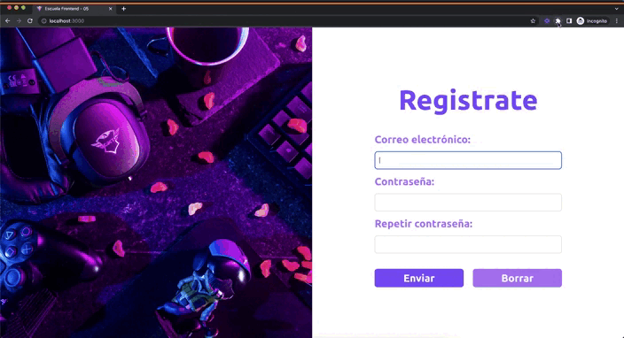

# Formularios accesibles

## Tus apuntes ✏️

Puedes usar este espacio para apuntar tus aprendizajes de esta lección.


## Outline

Los formularios son un mecanismo para capturar información de los usuarios, millones de formularios están ahi afuera recolectando información de usuarios, encuestas, calificaciones, busquedas, entre otros casos de uso. Es evidente que es uno de los widgets que mas pueden encontrarse los usuarios en la red, por ello, es muy importante garantizar una buena experiencia para aquellos usuarios que tienen discapacidades.


### Enfocando los campos facilmente

Usuarios con discapacidades visuales y/o discapacidades motoras, les resulta más útil que los campos sean enfocados una vez presionen el label del campo que buscan llenar. HTML habilita este comportamiento en dos simples pasos:

```html
  <!-- 1. Proporcionar el atributo for o htmlFor si estás usando React para la etiqueta label  -->
  <label for="name">Nombre</label>
  <!-- 2. Usar como atributo id para el input el mismo valor del atributo for usado en el label  -->
  <input id="name" type="text" />
```

El comportamiento sera el siguiente:


### No dependas solo del color

Comunicar mensajes, alertas, o errores a los usuarios usando solamente colores, es una mala idea ya que muchos de ellos pueden sufrir de deficiencia en la visión del color, daltonismo o ceguera total lo que significa que una gran población de usuarios no interpreta los colores de la misma forma que lo hacen quienes no sufren estas condiciones.

**Contraste alto apagado**


**Contraste alto encendido**





Puedes usar colores, pero no dependas solo de ellos. Acompaña tus alertas con mensajes claros que le indiquen al usuario lo que está pasando.


## Pongamoslo a prueba 💪

### Objetivos 🎯
- Reconocer las ventajas de usar la etiqueta `label` y conectarla con un `input` respectivo.
- Descubrir las desventajas de comunicar mensajes unicamente a través de colores.
- Explorar las maneras en las que los usuarios cambian la configuración visual.

### Ejercicios 💻

1. Familiarizate con el código ubicado en `05.jsx` y usa con el formulario presentado para este ejercicio.
2. Relaciona los labels con los inputs siguiendo las instrucciones en el archivo. 
3. Mejora la forma en la que se comunican los errores que ocurren dentro de el formulario.


