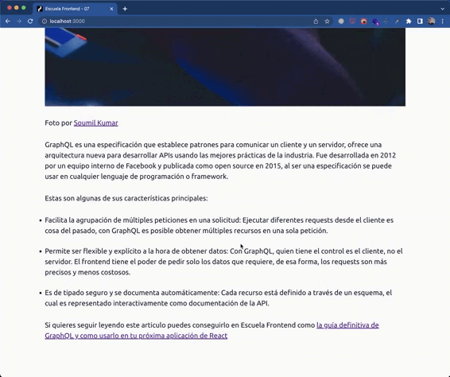
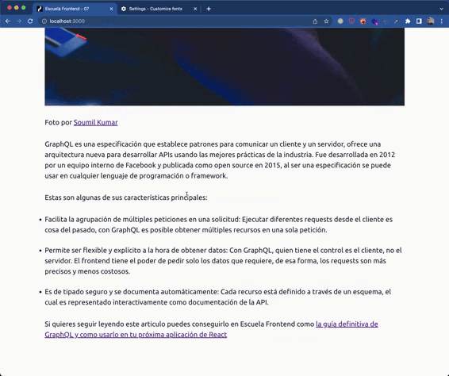

# CSS Accesible: Semantica visual y tamaño de tipografia

## Tus apuntes ✏️

Puedes usar este espacio para apuntar tus aprendizajes de esta lección.

## Outline

### Semantica visual

Tu CSS puede contribuir a la accesibilidad del sitio evitando arruinar los estilos principales de los elementos. Y es que por convención, o por experiencia los usuarios tiene una idea de cómo luce un enlace, cómo luce un botón o un input.

En nombre de los usuarios con discapacidades cognitivas, es nuestro deber facilitar la experiencia de navegación, interacción e interpretación del contenido de la web evitando generar patrones confusos en los sitios web.

Foto por Andre Placquario de [Pexels](https://www.pexels.com/photo/man-wearing-brown-jacket-and-using-grey-laptop-874242)

### Tamaño de tipografia

Otra de las maneras en las que puedes escribir CSS accesible es teniendo en cuenta las necesidades de las personas con discapacidades visuales parciales. Muchos usuarios tienen problemas a la hora de leer el contenido con el tamaño de letra que soportamos quienes no tenemos está discapacidad.

Por eso quienes necesitan escalar el tamaño de fuente acuden a dos tecnicas:

#### Escalado por zoom

El usuario usa la función de zoom en su navegador (control + (+))

#### Escalado por tamaño de fuente

El usuario configura su navegador para tener un tamaño base de fuente mas grande (ajustes -> tamaño de fuente).

En el caso del segundo approach existe un problema y es que si el tamaño de la tipografia está definido sobre unidades absolutas como los `px`, está alteración en la configuración del navegador no hará efecto en el sitio y por lo tanto el usuario no podra acomodar el tamaño a su necesidad. La recomendación siempre para tamaños de fuente es usar unidades relativas como `em` o `rem` para que la fuente pueda escalar si el usuario así lo desea:

- `em`: Unidad relativa al tamaño de fuente del elemento padre.
- `rem`: Unidad relativa al tamaño de fuente unicamente del body (recomendada).

## Pongámoslo a prueba 💪

### Objetivos 🎯
- Entender la importancia de los estilos establecidos por los navegadores.
- Analizar la semantica visual de los elementos y su impacto en la cognitiva.
- Descubrir estrategias para servir contenido a los usuarios con discapacidades visuales.

### Ejercicios 💻

1. Analiza el blog y su composición, descubre cuales son los problemas que su aspecto puede generar.
2. Establece las propiedades de CSS que permitirían a los usuarios entender que el texto "La Guía Definitiva de GraphQL" es un encabezado.
3. Modifica los estilos para que los usuarios reconozcan las caracteristicas de este articulo como una lista de elementos.
4. Organiza las propiedades de CSS para que los enlaces se reconozcan más facilmente, incluyendo su estado de `:visited`

#### Crédito Extra 01 👑

Algunos de nuestros usuarios consideran que el tamaño de fuente es algo pequeño y les cuesta leerlo, al estar usando `px` como unidad modificar la configuración de apariencia del navegador no funcionará.

¿Como podemos solucionar este problema?