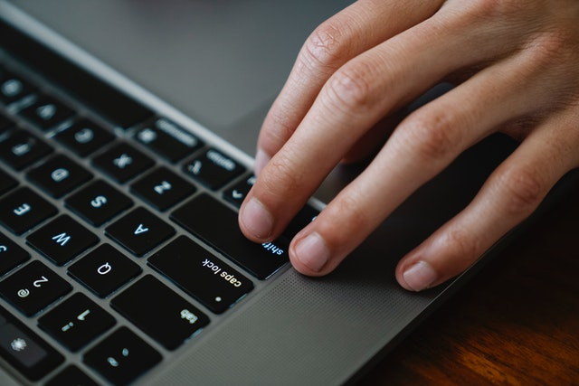

# Javascript & ARIA: Eventos del mouse

## Tus apuntes ✏️

Puedes usar este espacio para apuntar tus aprendizajes de esta lección.

## Outline

Foto por Eren Li de [Pexels](https://www.pexels.com/photo/crop-office-worker-typing-on-laptop-at-table-7241628/)

Javascript es un lenguaje orientado a eventos el cual nos permite realizar diferentes flujos a partir de las acciones de los usuarios. El mal uso de los eventos en la creación de nuestras aplicaciones puede generar problemas de accesibilidad al definir eventos demasiado específicos para un público que puede usar un widget de diferentes maneras.

Para ilustrarlo mejor piensa en un simple contador que tiene un botón para aumentar y otro para disminuir la cuenta. Como ambos elementos están relacionados usando el evento `onClick`, los usuarios que manipula el contador a través del teclado y sus respectivos eventos `onKeyDown` no podrán utilizarlo y quedarán totalmente bloqueados.

La mejor manera para incluir a los usuarios que navegan a través del teclado es pensar como la interacción del mouse puede ser recreada con los eventos del mouse:

- Quieres hacer un efecto de hover? Piensa en `onMouseOver` + `onMouseOut` y al mismo tiempo en `onFocus` y `onBlur`.
- Quieres escuchar un click? Piensa en `onClick` y al mismo tiempo en `onKeyDown` validando que la tecla presionada sea <kbd>Enter</kbd> o <kbd>Espacio</kbd>.

Así, los widgets que solo funcionaban usando el mouse adquieren las mismas capacidades esta vez con el teclado.

## Pongámoslo a prueba 💪

### Objetivos 🎯
- Descubrir los problemas de los eventos cuando no se piensa con accesibilidad.
- Conocer los eventos del teclados que son análogos a los eventos del mouse.
- Aprender a devolver accesibilidad a los elementos customizados.

### Ejercicios 💻

1. Estamos construyendo un reproductor de video custom, cuenta con controles para reproducir, parar y pausar el video, encuentra los problemas de accesibilidad!
2. Habilita el enfoque por teclado del componente de video usando la propiedad `tabIndex` en el contenedor principal.
3. Permite que los usuarios que navegan por teclado puedan visualizar los controles de la misma forma que lo hacen los usuarios (`onFocus` + `onBlur`).

#### Crédito Extra 01 👑

Ahora que los usuarios pueden visualizar los controles del reproductor, también deberían poder usarlos con el teclado. Para hacerlo tenemos que devolver accesibilidad a los controles, aquí tienes algunas pistas:

1. Permite que las imágenes se puedan enfocar con el teclado de la misma forma que lo hicimos en el contenedor principal.
2. Habilita que los controles puedan ser presionados con el teclado, como el evento que usarás (`onKeyDown`) escuchará cualquier tecla, es importante que valides que solo las teclas <kbd>Enter</kbd> o <kbd>Space</kbd> sean validas.

#### Crédito Extra 02 👑

Menos es más, vamos a demostrar porque el HTML semántico reduce la complejidad en la creación de aplicaciones web accesibles:

1. Reemplaza las imágenes en el componente `<Controls />` por botones con sus respectivas clases: `controls__button--play`, `controls__button--pause` y `controls__button--stop`.
2. Elimina los eventos de `onKeyDown` así como las validaciones en los manejadores de eventos.
3. Elimina las propiedades `tabIndex` de los controles puesto que ya no son necesarios.
4. Usa de nuevo el componente con el teclado y reflexiona sobre los beneficios que tiene usar las etiquetas correctas.